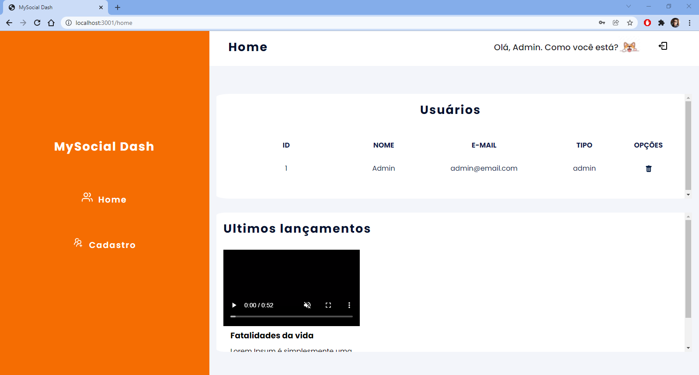

<h1>Projeto: MySocial Dash 📌</h1>

    <em><strong>ÍNDICE</strong></em>

 
 

    <a href="#sobre" align=center>Sobre o projeto</a>&nbsp;&nbsp;&nbsp;
    <a href="#demostracao" align=center>Demostração do projeto</a>&nbsp;&nbsp;&nbsp; 
    <a href="#linguagens" align=center>Linguagens & Frameworks</a>&nbsp;&nbsp;&nbsp;
    <a href="#biografia" align=center>Biografia</a> 

 

<h3 id="sobre">Sobre o projeto:</h3>

Dashboard com redirecionamento e restrições de usuários: administrador e/ou usuário.

 

<h4>Skills obtidas com esse projeto</h4>

 

✔️ Redirecionamento de rotas

✔️ Lógica de restrições

✔️ Noções de useContext e CreateContext

✔️ Login por autenticação

✔️ Notificações intuitivas

✔️ Criação de Components

✔️ Noções de SASS

✔️ Uso de variáveis globais de estilização

 

<h3 id="status">Status</h3> 

**_Concluído 🚀_**

 

    <h3 id="demostracao">Demostração</h3>
     
    <h4>Tela Login de usuário com email e senha<h4>
    
      
    <h4>Tela Home<h4>
    
      
    <h4>Tela Cadastro<h4>
    
     
    <h4>Tela Outras Páginas<h4>
    
     

<h3 id=linguagens>Linguagens & Frameworks</h3>

* React 
* Javascript
* SASS
* Html

 

<h3 id="#biografia">Biografia</h3> 

 Meu nome é Leonardo, mas prefiro Leo. Estou graduando em Sistemas de Informação e estagiário de desenvolvimento Front-End.
 

<h3 align=center><i>Gostos e Hobbies </i>📖🙋‍♂️</h3> 

Caminhar, correr, ciclismo, exercícios físicos, estudar, ler e aprender sobre desenvolvimento de sites e aplicações.
 

    <h3><strong>Contatos</strong></h3>
     
    
    &nbsp;&nbsp;&nbsp;&nbsp;&nbsp;&nbsp;&nbsp;&nbsp;&nbsp;
     
    &nbsp;&nbsp;&nbsp;&nbsp;&nbsp;&nbsp;&nbsp;&nbsp;&nbsp;
       
    &nbsp;&nbsp;&nbsp;&nbsp;&nbsp;&nbsp;&nbsp;&nbsp;&nbsp;
    

